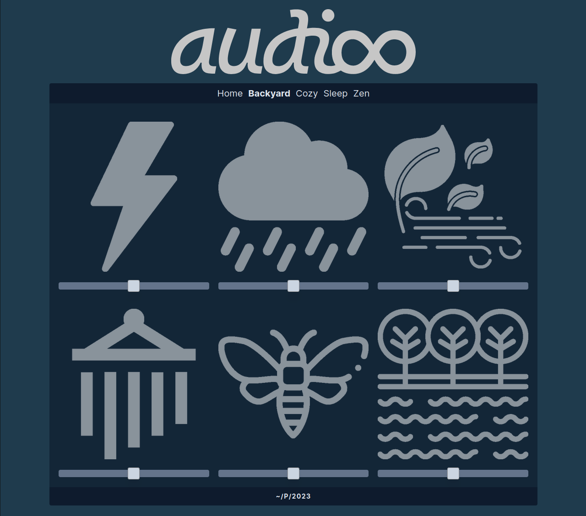

 

  
  

    <h3>A web app that promotes focus, relaxation, and sleep through playing a variety of sounds.</h3>
    <a href="https://audioo.org">audioo.org</a> 
    <a href="https://github.com/gnprwx/audioo/issues">Report Bug</a> 
    <a href="https://github.com/gnprwx/audioo/issues">Request Feature</a>
  

 

## Table Of Contents

- [Preview](#preview)
- [Built With](#built-with)
- [Getting Started](#getting-started)
- [Usage](#usage)
- [Roadmap](#roadmap)
- [Authors](#authors)
- [Acknowledgements](#acknowledgements)

## Preview

## Built With

Typescript, React, React-Howler, React-Router, TailwindCSS, Vite Image Tools, and deployed with Netlify

## Usage

Click on an icon to play the sound. You can adjust the volume with the slider below the icon. The sounds loop indefinitely until you click to turn them off again.

If you are using the site on your phone, you may need to make sure your phone is off silent mode. This is due to using the howler engine for audio as HTML5 audio is very limited in functionality.

## Roadmap

See the [open issues](https://github.com/gnprwx/audioo/issues) for a list of proposed features (and known issues).

## Authors

[**Greg Pappas**](https://pappas.sh)
